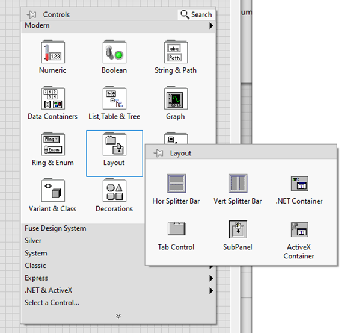

# LabVIEW Installation Guide

## Overview

This document provides a comprehensive guide for installing **LabVIEW**, including system requirements, installation steps, and an introduction to its key features and functionalities. LabVIEW (Laboratory Virtual Instrument Engineering Workbench) is a graphical programming environment widely used in research, industry, and academia.

## Installation Steps

1. **Download LabVIEW**: Visit [NI LabVIEW Download](https://www.ni.com/en/support/downloads/software-products/download.labview.html#559079) and download the software.
2. **Sign Up & Log In**: Create an NI account and log in to proceed with the download.

&nbsp;&nbsp;&nbsp;&nbsp;&nbsp;&nbsp;&nbsp;&nbsp;&nbsp;

1. **Select Version**: Choose **LabVIEW 2025 Q1 Community Version** and start the download.
2. **Run the Installer**: Open the downloaded Disc Image file, double-click it, and navigate to the `.exe` folder.
3. **Install LabVIEW**: Run `install.exe` and follow the on-screen instructions.
4. **Install VI Package Manager**: This will be installed automatically. Choose `3D Express` or any other required software.
5. **Completion**: LabVIEW is now installed and ready for development.

## LabVIEW Overview

LabVIEW uses a **graphical programming language** called **G**, where programs are created using **Block Diagrams**.

### 🔹 Key Components

#### 1️ **Front Panel & Controls Palette**

- The **Controls Palette** is available on the **Front Panel** and contains various controls and indicators for building the user interface.
- It provides UI elements such as **numeric controls, Boolean controls, strings, graphs, arrays, and clusters**. 
  &nbsp;&nbsp;&nbsp;&nbsp;&nbsp;&nbsp;&nbsp;&nbsp;&nbsp;&nbsp;&nbsp;&nbsp;

#### 2️ **Block Diagram & Function Palette**

- The **Function Palette** is used for programming and is available on the **Block Diagram**.
- It includes categories like **Numeric, Array, Time and Dialog, Waveform, Measurement I/O, Signal Processing, and Data Connectivity**.   
  &nbsp;&nbsp;&nbsp;&nbsp;&nbsp;&nbsp;

#### 3️ **Tool Palette**

- Allows users to **create, modify, and debug Virtual Instruments (VIs)**.
- Shortcut: `Shift + Right Click`
- Common tools include:
  - **Operating Tool**: Select text or change control values.
  - **Positioning Tool**: Resize and position elements.
  - **Labeling Tool**: Edit text.
  - **Object Shortcut Menu Tool**: Access the shortcut menu of an object. 
    &nbsp;&nbsp;&nbsp;&nbsp;

## 🔹 Common Keyboard Shortcuts

| Shortcut   | Description                                   |
| ---------- | --------------------------------------------- |
| `Ctrl + B` | Deletes all broken wires in VI                |
| `Ctrl + .` | Stops the running VI                          |
| `Ctrl + E` | Toggles between Front Panel and Block Diagram |
| `Ctrl + T` | Displays both panels on one screen            |

## 🛠 Important LabVIEW Functions

## **Formula Node**

A **Formula Node** allows users to write text-based formulas inside LabVIEW’s Block Diagram.

- **Usage:** Perform mathematical calculations, data transformations, and conditional logic.
- **Syntax:** Supports `+`, `-`, `*`, `/`, `^`, logical operators (`AND`, `OR`, `NOT`), and functions (`SIN`, `COS`, `LOG`, etc.).

#### &nbsp;&nbsp;&nbsp;&nbsp;&nbsp;&nbsp;**Common Use Cases:**

- Data transformation & scaling
- Implementing conditional statements (IF-ELSE, CASE)
- Performing mathematical calculations (e.g., trigonometry, signal processing)

## **Layout & Components**

### **Tab Control**

- Works like multiple web pages in a single interface.  
  

### **Controls Palette**

&nbsp;&nbsp;&nbsp;&nbsp;&nbsp;&nbsp;&nbsp;&nbsp;

Includes:

- **Numeric Controls** (for numbers & calculations)
  &nbsp;&nbsp;&nbsp;&nbsp;&nbsp;&nbsp;&nbsp;&nbsp;    
- **Boolean Controls** (for switches & buttons)  
  &nbsp;&nbsp;&nbsp;&nbsp;&nbsp;&nbsp;&nbsp;&nbsp;
- **String Controls** (for text handling)  
  &nbsp;&nbsp;&nbsp;&nbsp;&nbsp;&nbsp;&nbsp;&nbsp;
- **Array, List, Table, & Tree**   
  &nbsp;&nbsp;&nbsp;&nbsp;&nbsp;&nbsp;&nbsp;&nbsp;
- **Ring & Enum** (for dropdown selections)  
  &nbsp;&nbsp;&nbsp;&nbsp;&nbsp;&nbsp;&nbsp;&nbsp;
- **I/O Functions** (for data input & output)  
  &nbsp;&nbsp;&nbsp;&nbsp;&nbsp;&nbsp;&nbsp;&nbsp;
- **Decorations** (for UI enhancements)  
  &nbsp;&nbsp;&nbsp;&nbsp;&nbsp;&nbsp;&nbsp;&nbsp;
- **.NET& ACtiveX**  

### **Function Palette**   

&nbsp;&nbsp;&nbsp;&nbsp;&nbsp;&nbsp;&nbsp;&nbsp;

Contains:

- **Programming Functions** (for logic implementation)   
  &nbsp;&nbsp;&nbsp;&nbsp;&nbsp;&nbsp;&nbsp;&nbsp;
- **Timing Functions** (for controlling execution flow)   
  &nbsp;&nbsp;&nbsp;&nbsp;&nbsp;&nbsp;&nbsp;&nbsp;

## Conclusion

This guide covers the complete **LabVIEW installation process**, an **overview of LabVIEW**, and a **detailed breakdown of its components**, including the **Front Panel, Block Diagram, and Tool Palette**. With this knowledge, users can efficiently start developing in LabVIEW.  

**Authored by**: <spam style = "color:grey;"><i>Yamini Pothana</i></spam>
